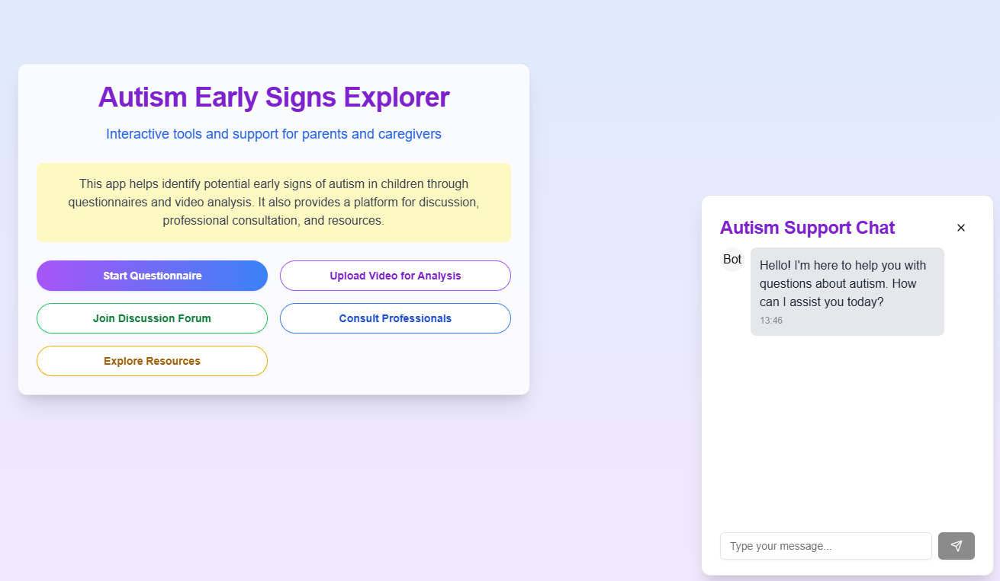

# Autism Early Signs Explorer  

Interactive tools and support for parents and caregivers to identify early signs of autism in children.  

  

## Overview  

Autism Early Signs Explorer is a prototype tool designed to help parents and caregivers detect potential early signs of autism in children. Through interactive questionnaires, video analysis (prototype), and access to educational resources, the app fosters awareness and provides support for timely intervention.  

This project was built in *4 hours* as part of a hackathon, showcasing the power of rapid prototyping to address societal challenges.  

---

## Key Features  

- **Interactive Tools**:  
  - Start a questionnaire to assess behavioral patterns.  
  - Upload videos for initial analysis of signs such as repetitive movements or lack of eye contact (prototype feature).  

- **Support Network**:  
  - Join discussion forums to connect with other parents and caregivers.  
  - Access professional consultations and expert guidance.  
  - Explore a library of educational resources on autism awareness and support.  

- **Fast Prototyping**:  
  Built entirely within *4 hours*, demonstrating how tech can address critical issues effectively.  

---

## Tech Stack  

- **Frontend**:  
  - Built using **Next.js** for a responsive and modern UI design.  

- **Backend**:  
  - Developed with **FastAPI**, ensuring a lightweight and high-performance backend.  

- **Database**:  
  - **CassandraDB** was used for embeddings and managing behavioral data efficiently.  

---

## How to Run the Project  

1. Navigate to the `frontend` directory:  
   ```bash  
   cd frontend  
   ```  
2. Install dependencies:  
   ```bash  
   npm install  
   ```  
3. Start the development server:  
   ```bash  
   npm run dev  
   ```  
## Future Enhancements  

- Refine video analysis capabilities to improve accuracy using advanced machine learning models.  
- Incorporate multilingual support for wider accessibility.  
- Expand the resource library with more materials tailored to different user needs.  
- Enable real-time video analysis for quicker feedback.  

---

## Contributions  

Contributions are welcome! Please fork this repository, make your changes, and submit a pull request.  

---

## License  

This project is licensed under the [MIT License](LICENSE).  

---
